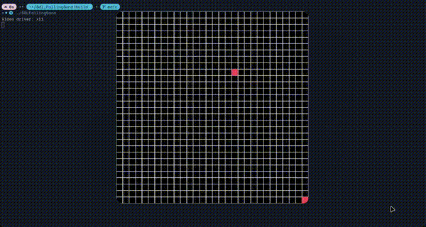

# Sdl_FallingSand

Falling sand implemented in sdl3



## Play Instructions
Up arrow to enable/disable draw mode \n
spacebar to run/stop the simulation

## CLONING

There are submodule present in the repo so be sure to clone it recursively with the following command:

```
git clone --recursive https://github.com/KATZ5/Sdl_FallingSand.git
cd Sdl_FallingSand
```

Updating submodules manually:

```
git submodule init
git submodule update
```

## BUILDING

The repository contains everything required to compile and build the examples on **Windows**, **Linux** using a compiler that supports c++98 and cmake as the build system

### Windows, Linux

Use the provided CMakeLists.txt with CMake to generate a build configuration for your favorite IDE or compiler, e.g.:

Windows using Visual Studio:

```
mkdir build
cd build
cmake .. -G "Visual Studio 14 2015 Win64"
```

Windows using MinGW:

```
mkdir build
cd build
cmake .. -G "MinGW Makefiles"
mingw32-make
```

Linux:

```
mkdir build && cd build
cmake ..
make
```
